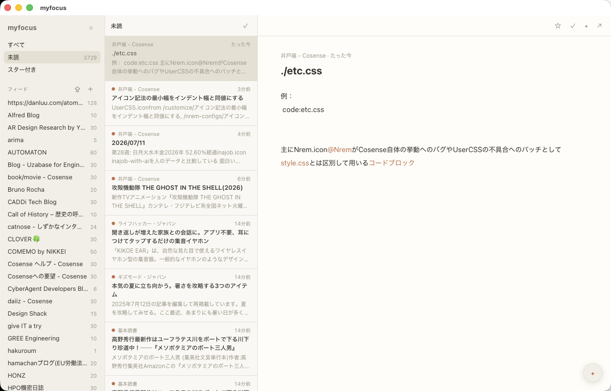
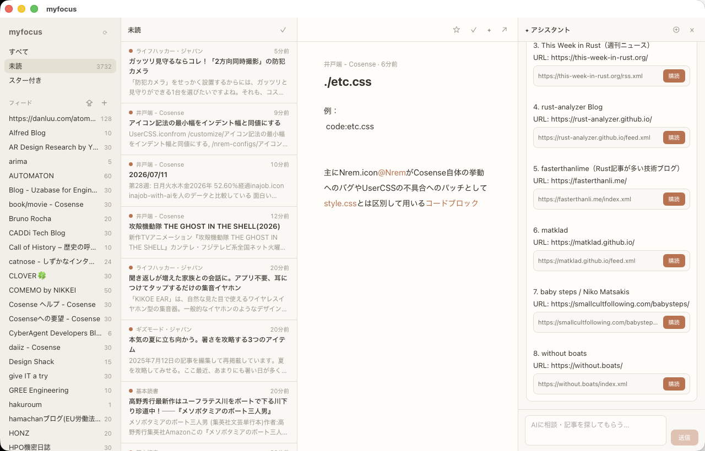

# myfocus

全部読むことをUIから強制されない、けれど全部読もうとすれば読めるRSSリーダー。

バックエンドサーバー不要でクライアントサイドに完結したクロスプラットフォームのデスクトップアプリです（Tauri 2 + React + Rust）。



## 特徴

- **3ペインUI**: [Reeder](https://reederapp.com/) を参考にした落ち着いたデザイン。ライト/ダークモード対応
- **あいまい検索（⌘K）**: fzf系マッチャ（[nucleo-matcher](https://github.com/helix-editor/nucleo)）による記事のファジー検索。`gost` で `GHOST` がヒットするサブシーケンス一致
- **AIアシスタント**: [Pi coding agent](https://pi.dev/) をRPCモードで組み込み。読んでいる記事についての相談や、新しい記事・フィードの探索ができる。AIが提案したフィードはワンクリックで購読
- **ローカル完結**: 記事はSQLiteに永続化。起動中は15分ごとに全フィードを自動更新し、フィードの窓から記事が流れ落ちる前にローカルへ確保する
- **OPMLインポート**: Inoreader等からのエクスポートファイルを取り込み可能（並列フェッチ）
- **フィード自動発見**: サイトのURLを入れると `<link rel="alternate">` からフィードURLを検出



## セットアップ

必要なもの:

- [Rust](https://rustup.rs/)（stable最新版。`rustup update stable` を推奨）
- [Node.js](https://nodejs.org/) 22系 + [pnpm](https://pnpm.io/)
- [pi CLI](https://pi.dev/)（AI機能を使う場合。未インストールでもRSSリーダーとしては動作します）

```sh
pnpm install

# 開発モードで起動
pnpm tauri dev

# 配布用ビルド
pnpm tauri build
```

AI機能はローカルの `pi` コマンドを `--mode rpc` で起動して使います。プロバイダーやAPIキーは pi 側の設定（環境変数や `~/.pi`）がそのまま使われます。

## 操作

| 操作 | キー / UI |
|---|---|
| あいまい検索 | ⌘K |
| 次の記事 / 前の記事 | j / k |
| フィード追加 | サイドバーの ＋ |
| OPMLインポート | サイドバーの ⇪ |
| AIアシスタント | 右下の ✦ |
| 記事についてAIに相談 | リーディングペインの ✦ |

## アーキテクチャ

```
src-tauri/src/
├── lib.rs        Tauriコマンド・ポーリング・OPMLインポート・フィード自動発見
├── db.rs         SQLiteスキーマとクエリ（rusqlite）
├── fetcher.rs    フィード取得とパース（reqwest + feed-rs）
├── search.rs     あいまい検索（nucleo-matcher）
└── pi_bridge.rs  pi --mode rpc のサブプロセス管理とイベント中継

src/
├── App.tsx                  状態管理とレイアウト
├── usePi.ts                 PiのJSONLイベントストリームを購読するフック
└── components/
    ├── Sidebar.tsx          フィード一覧・追加・OPMLインポート
    ├── ArticleList.tsx      記事リスト
    ├── ReadingPane.tsx      本文表示（DOMPurifyでサニタイズ）
    ├── SearchOverlay.tsx    ⌘K検索
    └── AiPanel.tsx          AIチャット（FEED:行を購読ボタンに変換）
```

- 記事DBの場所:
  - macOS: `~/Library/Application Support/jp.tanabe.myfocus/myfocus.db`
  - Windows: `%APPDATA%\jp.tanabe.myfocus\myfocus.db`
- AIへのフィード提案プロトコル: アシスタントは応答に `FEED: <url>` 行を含めるようシステムプロンプトで指示されており、UIがこの行を購読ボタンとしてレンダリングする

## 設計メモ

RSSフィードは通常直近10〜50件しか保持しないため、「全部読める」を保証するには記事が流れ落ちる前の取得が必要になる。実測では猶予は大量更新ニュースサイトで半日〜1日、技術ブログで1週間前後、個人ブログでは数週間以上。毎日PCを使う人がデスクトップ常駐で使う想定なら、サーバーなしのクライアント完結でほぼ成立する——という判断でこの構成にしている。

将来サーバー同期が欲しくなった場合は、FreshRSS / Miniflux等のGoogle Reader互換APIクライアント機能を追加する余地を残してある。
